# 统计文本行数
> 统计文本行数. 类似wc -l 一样.

注意点:
1. 文件大小
2. 内存大小

## 准备工作
    
 php版本:7.4
 操作系统: Macos10.15.7
 配置: 16GB 3.1 GHz 双核Intel Core i7 
    
生成文本:
```bash
// 生成1k随机文本
dd if=/dev/random of=1k.txt bs=1k count=1
// 1m
dd if=/dev/random of=1mb.txt bs=1m count=1
// 100MB
dd if=/dev/random of=100m.txt bs=1m count=100
// 1G的文本
dd if=/dev/random of=1g.txt bs=1m count=1024
// 4G
dd if=/dev/random of=4g.txt bs=1g count=4
```
如下
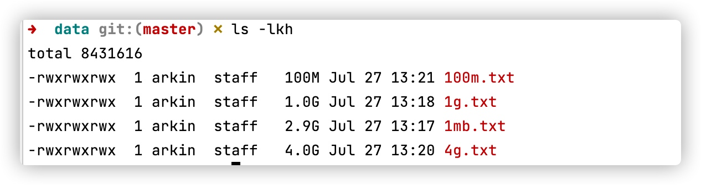


测试代码
```php
<?php declare(strict_types=1);
    ini_set('memory_limit','-1');
    Trace::Start();
    Trace::Log('前'); // 统计内存和时间
    // 运行代码
    $lines=1000;
    var_dump($lines);
  
    Trace::Log('后');
    Trace::End();
?>
```

参考内存和时间:
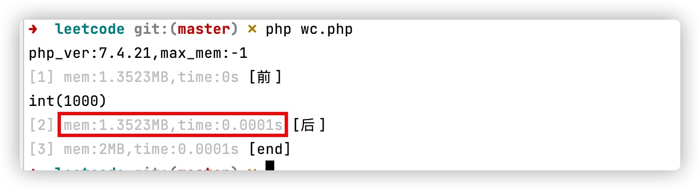

ver_dump 内存占用:1.35MB  耗时0.0001秒 ,后面以这个为参考标准.

计算执行时间:
 `time php wc.php`
为
```
php wc.php  0.07s user 0.06s system 95% cpu 0.138 total
```

参考wc命令执行结果. 注意wc -l 统计比实际少1行.


## 方案1:

使用file函数.
`file()` :把整个文件按行读入一个数组中.
优点: 代码量少
缺点: 占用内存比较高

```php
function countLine1(string $file):int{
    return count(file($file));
}
```

* 1k文件

`wc -l data/1k.txt`

2行,耗时: 0.003

`time php wc.php`
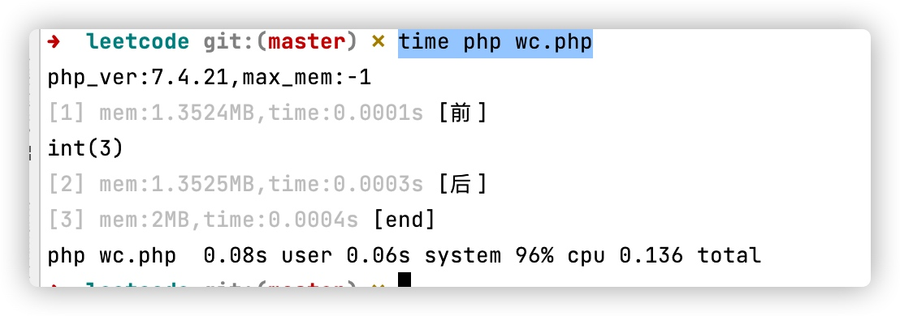

3行,耗时: 0.136,内存:2MB

* 1MB

[wc]
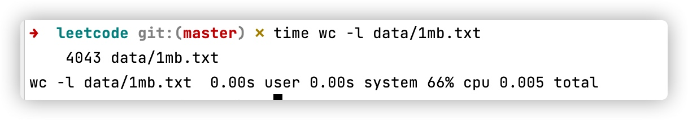
4000行,耗时0.005秒


[php]
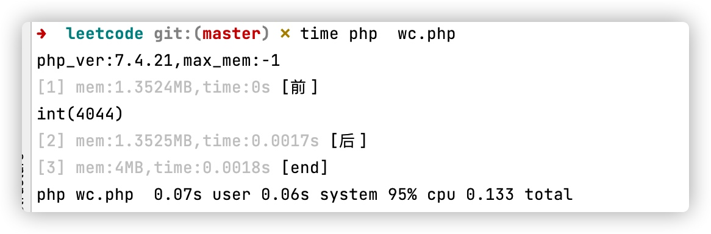
4000行,0.133秒,内存4MB ,1MB文件可以接受范围内.

结论,内存128MB可使用50MB文件.时间在200毫秒左右.
如果大于1大于内存就不适合了.


## 第二种方法
fget: 逐行读取.
注意: fget的默认最大长度为1024字节,在长度范围内如果遇到换行符就返回,如果超过1024字节没有换行符就会新起一行.

```php
function countLine2(string $file):int{
    $count=0;
    try {
        $fp = fopen($file, 'r');
        while (!feof($fp)){
            $buff=fgets($fp,1024);
            if($buff!==false && $buff[-1]=="\n"){
                $count++;
            }
        }

    }
    finally {
        if(is_resource($fp)){
            fclose($fp);
        }
        return $count;
    }
}
```

执行效率:
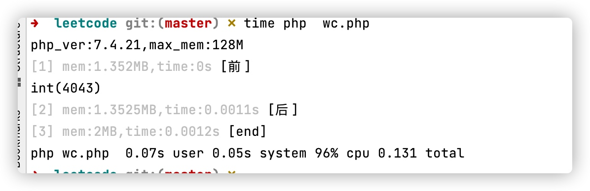
1MB文件,4000行,耗时0.13秒,内存2MB


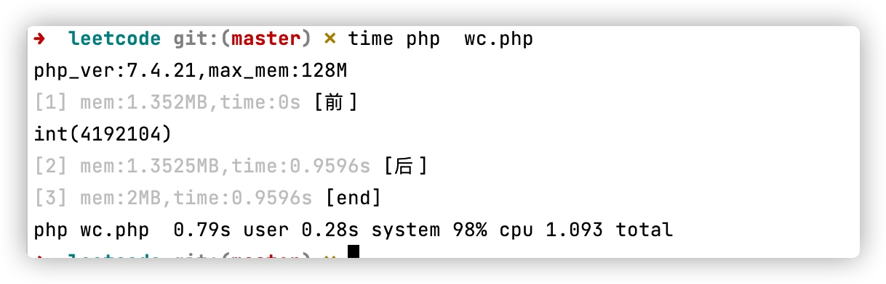
1G文件,耗时1.093秒,内存2MB

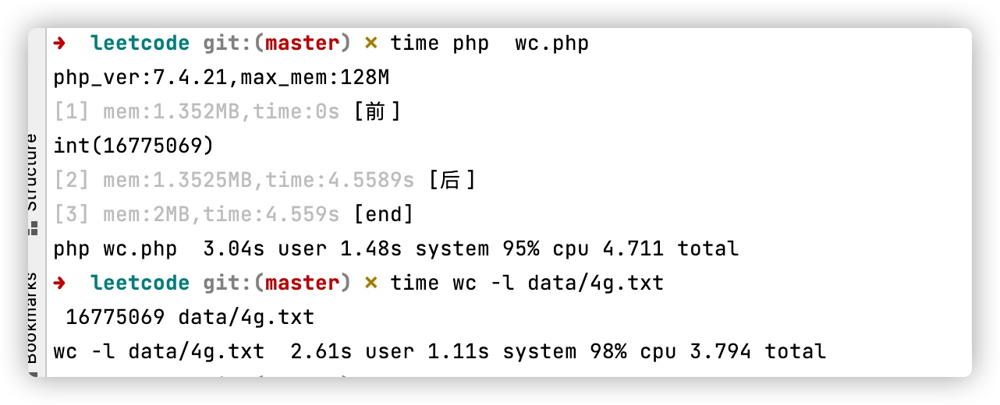
4G文件,与wc相差1秒.

结论: 无论多大的文件都不会占用太多内存,但性能比wc差.
主要是按行切割,寻找换行符.

## 第三种方案

使用fread然后在substr_count统计换行符数量.

```php

function countLine3($file)
{
    $i = 0;
    try {
        $fp = fopen($file, "r");

        while (!feof($fp)) {
            if ($data = fread($fp, 1024 * 100)) {
                $num = substr_count($data, "\n");
                $i += $num;
            }
        }
        fclose($fp);
        return $i;
    }finally {
        if(is_resource($fp)){
            fclose($fp);
        }
        return  $i;
    }
}
```

1K时
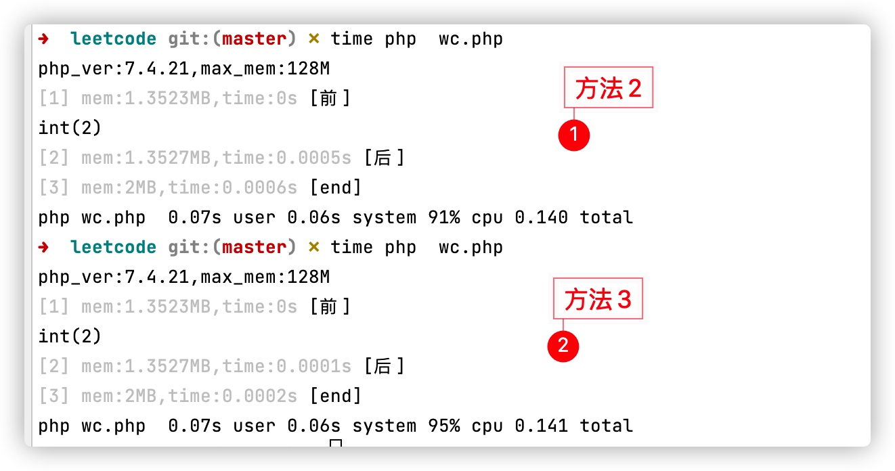

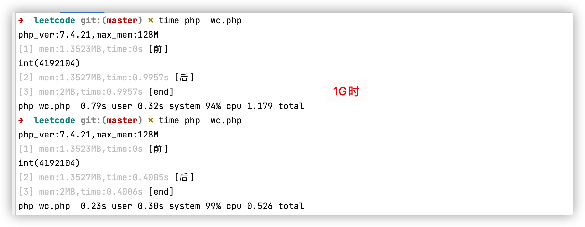
1G时,内存一样,耗时减半.

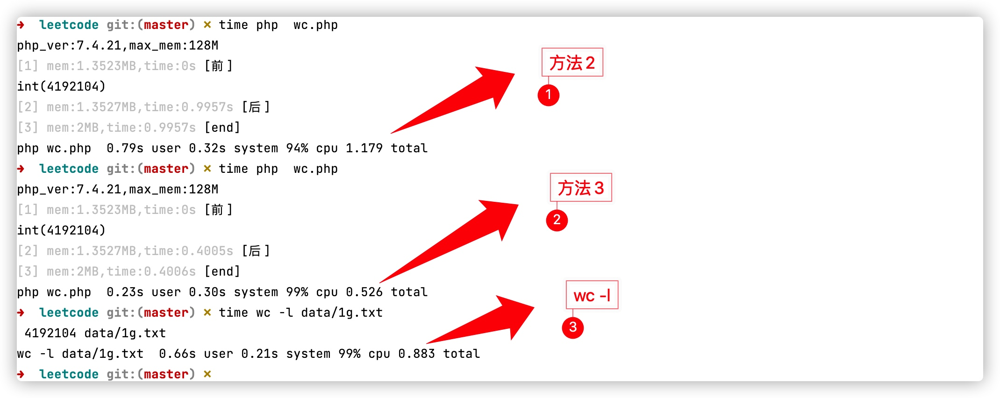
与wc -l 相比时间减少1/3.


结论: fread 自定义分段读取内容,然后在统计换行符数量.
每行字符数量很少时,可以一次性读取很多行,而不是逐行读取,在内存中计算那换行数量,减少文件io.

